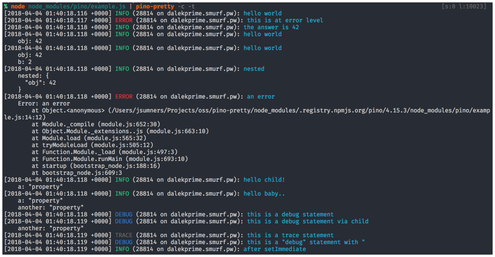

<a id="intro"></a>
# pino-pretty

[](https://www.npmjs.com/package/pino-pretty)
[](https://github.com/pinojs/pino-pretty/actions?query=workflow%3ACI)
[](https://snyk.io/test/github/pinojs/pino-pretty)
[](https://coveralls.io/github/pinojs/pino-pretty?branch=master)
[](https://standardjs.com/)

This module provides a basic [ndjson](http://ndjson.org/) formatter. If an
incoming line looks like it could be a log line from an ndjson logger, in
particular the [Pino](https://getpino.io/) logging library, then it will apply
extra formatting by considering things like the log level and timestamp.

A standard Pino log line like:

```
{"level":30,"time":1522431328992,"msg":"hello world","pid":42,"hostname":"foo","v":1}
```

Will format to:

```
[1522431328992] INFO (42 on foo): hello world
```

<a id="example"></a>
## Example

Using the [example script][exscript] from the Pino module, and specifying
that logs should be colored and the time translated, we can see what the
prettified logs will look like:



[exscript]: https://github.com/pinojs/pino/blob/fc4c83b/example.js

<a id="install"></a>
## Install

```sh
$ npm install -g pino-pretty
```

<a id="usage"></a>
## Usage

It is recommended to use `pino-pretty` with `pino`
by piping output to the CLI tool:

```sh
node app.js | pino-pretty
```

<a id="cliargs"></a>
### CLI Arguments

- `--colorize` (`-c`): Adds terminal color escape sequences to the output.
- `--crlf` (`-f`): Appends carriage return and line feed, instead of just a line
  feed, to the formatted log line.
- `--errorProps` (`-e`): When formatting an error object, display this list
  of properties. The list should be a comma-separated list of properties Default: `''`.
- `--levelFirst` (`-l`): Display the log level name before the logged date and time.
- `--errorLikeObjectKeys` (`-k`): Define the log keys that are associated with
  error like objects. Default: `err,error`.
- `--messageKey` (`-m`): Define the key that contains the main log message.
  Default: `msg`.
- `--levelKey` (`--levelKey`): Define the key that contains the level of the log.
  Default: `level`.
- `--levelLabel` (`-b`): Output the log level using the specified label.
  Default: `levelLabel`.
- `--messageFormat` (`-o`): Format output of message, e.g. `{levelLabel} - {pid} - url:{request.url}` will output message: `INFO - 1123 - url:localhost:3000/test`
  Default: `false`
- `--timestampKey` (`-a`): Define the key that contains the log timestamp.
  Default: `time`.
- `--translateTime` (`-t`): Translate the epoch time value into a human-readable
  date and time string. This flag also can set the format string to apply when
  translating the date to a human-readable format. For a list of available pattern
  letters, see the [`dateformat` documentation](https://www.npmjs.com/package/dateformat).
  - The default format is `yyyy-mm-dd HH:MM:ss.l o` in UTC.
  - Require a `SYS:` prefix to translate time to the local system's time zone. A
    shortcut `SYS:standard` to translate time to `yyyy-mm-dd HH:MM:ss.l o` in
    system time zone.
- `--search` (`-s`): Specify a search pattern according to
  [jmespath](http://jmespath.org/).
- `--ignore` (`-i`): Ignore one or several keys, nested keys are supported with each property delimited by a dot character (`.`), 
  keys may be escaped to target property names that contains the delimiter itself: 
  (`-i time,hostname,req.headers,log\\.domain\\.corp/foo`)
- `--hideObject` (`-H`): Hide objects from output (but not error object)
- `--singleLine` (`-S`): Print each log message on a single line (errors will still be multi-line)
- `--config`: Specify a path to a config file containing the pino-pretty options.  pino-pretty will attempt to read from a `.pino-prettyrc` in your current directory (`process.cwd`) if not specified

<a id="integration"></a>
## Programmatic Integration

We recommend against using `pino-pretty` in production and highly
recommend installing `pino-pretty` as a development dependency.

When installed, `pino-pretty` will be used by `pino` as the default
prettifier.

Install `pino-pretty` alongside `pino` and set the
`prettyPrint` option to `true`:

```js
const pino = require('pino')
const logger = pino({
  prettyPrint: true
})

logger.info('hi')
```

The `prettyPrint` option can also be an object containing `pretty-print`
options:

```js
const pino = require('pino')
const logger = pino({
  prettyPrint: { colorize: true }
})

logger.info('hi')
```

See the [Options](#options) section for all possible options.

<a id="options"></a>
### Options

`pino-pretty` exports a factory function that can be used to format log strings.
This factory function is used internally by Pino, and accepts an options argument
with keys corresponding to the options described in [CLI Arguments](#cliargs):

```js
{
  colorize: colorette.options.enabled, // --colorize
  crlf: false, // --crlf
  errorLikeObjectKeys: ['err', 'error'], // --errorLikeObjectKeys
  errorProps: '', // --errorProps
  levelFirst: false, // --levelFirst
  messageKey: 'msg', // --messageKey
  levelKey: 'level', // --levelKey
  messageFormat: false, // --messageFormat
  timestampKey: 'time', // --timestampKey
  translateTime: false, // --translateTime
  search: 'foo == `bar`', // --search
  ignore: 'pid,hostname', // --ignore
  hideObject: false, // --hideObject
  singleLine: false, // --singleLine
  customPrettifiers: {}
}
```

The `colorize` default follows
[`colorette.options.enabled`](https://github.com/jorgebucaran/colorette#optionsenabled).

`customPrettifiers` option provides the ability to add a custom prettify function
for specific log properties. `customPrettifiers` is an object, where keys are
log properties that will be prettified and value is the prettify function itself.
For example, if a log line contains a `query` property,
you can specify a prettifier for it:
```js
{
  customPrettifiers: {
    query: prettifyQuery
  }
}
//...
const prettifyQuery = value => {
  // do some prettify magic
}
```

`messageFormat` option allows you to customize the message output. A template `string` like this can define the format:
```js
{
  messageFormat: '{levelLabel} - {pid} - url:{request.url}'
}
```
This option can also be defined as a `function` with this prototype:
```js
{
  messageFormat: (log, messageKey, levelLabel) => {
    // do some log message customization
    return customized_message;
  }
}
```

<a id="license"><a>
## License

MIT License
